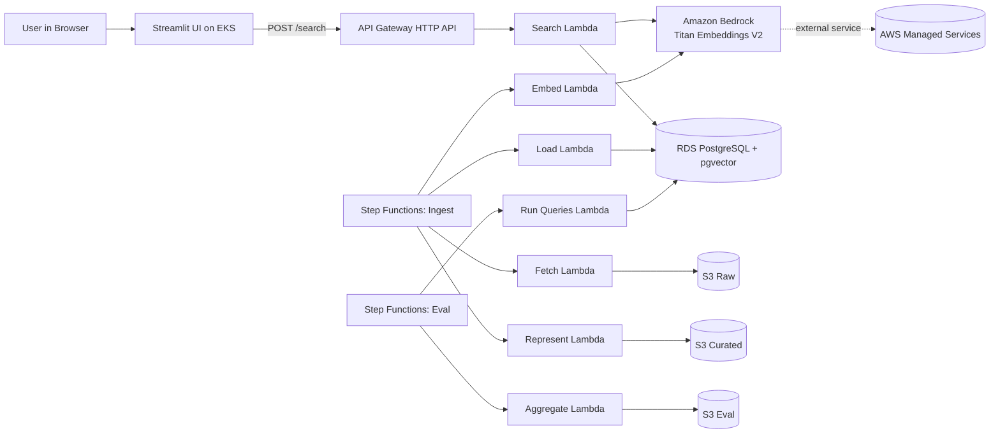

# Semantic Pokédex

Semantic search over Pokémon (Generations 1 and 2) using multiple text-representation strategies and vector embeddings.

This repository contains the initial scaffolding for a learning-focused system that compares representation and retrieval choices more than model complexity.

## Architecture



For deeper architecture details, see:

- [docs/architecture.md](docs/architecture.md)
- [docs/representation-strategies.md](docs/representation-strategies.md)

## Why this project exists

The project focuses on five practical retrieval lessons:

1. Representation strategy often matters more than model selection.
2. Similarity metrics change ranking behavior.
3. Embedding dimensionality affects quality, cost, and indexing behavior.
4. Metadata filtering and vector ranking should be combined.
5. ANN index parameters matter for latency and recall trade-offs.

## Tech stack

| Layer | Choice | Notes |
|---|---|---|
| Vector DB | PostgreSQL 17.9 + pgvector on existing RDS | Database `semantic_pokedex` created inside existing RDS instance |
| Embeddings in Lambda | Amazon Titan Text Embeddings V2 (`amazon.titan-embed-text-v2:0`) | 1024 dimensions |
| Embeddings local/UI | `sentence-transformers/all-MiniLM-L6-v2` | 384 dimensions, not used inside Lambda |
| Orchestration | Step Functions (Ingest + Eval) | Serverless Framework v3.35.2 |
| Compute | AWS Lambda (Python 3.11) | Ingest, evaluation, and search handlers |
| API | API Gateway HTTP API | `/search` endpoint |
| UI | Streamlit on existing EKS cluster | Kubernetes manifests included as placeholders |
| Storage | Amazon S3 | Raw, curated, and evaluation artifacts |

## Repository structure

```text
serverless/      # Infrastructure and serverless definitions
src/pokedex/     # Python package with handlers, strategies, embeddings, DB, search SQL builder
streamlit_app/   # Streamlit user interface
k8s/             # Kubernetes placeholders for existing EKS
evals/           # Evaluation query templates and methodology notes
scripts/         # Local helpers and bootstrap SQL
tests/           # Unit tests for core scaffolding behavior
```

## Local development quickstart

### Option A: using `uv`

```bash
uv venv
source .venv/bin/activate
uv pip install -e ".[dev]"
pytest -q
```

### Option B: using `pip`

```bash
python -m venv .venv
source .venv/bin/activate
pip install -e ".[dev]"
pytest -q
```

### Validate Serverless config parsing

```bash
cd serverless
npm install
npx serverless print --stage dev
```

## How to deploy

Deployment commands and rollout automation are intentionally **out of scope in this PR**.

This scaffolding PR only provides:

- source files,
- infrastructure definitions,
- local validation,
- and baseline tests.

A later PR should define and validate a controlled deployment process.

## Budget note

- Budget target: **$100 total AWS budget for this project area**.
- Operating target: **under $50/month** for normal development usage where possible.
- Existing EKS cluster costs are assumed to be tracked independently.

## Next milestones

1. Populate ingestion with full Gen 1–2 data and competitive metadata.
2. Add 30 labeled eval queries and benchmark harness.
3. Tune HNSW and filters for recall@10 and latency targets.
4. Add production-grade observability and deployment workflow in follow-up work.

## License

MIT (add license file in a follow-up PR if needed).

## Despliegue manual con Docker

Puedes desplegar la aplicación desde tu máquina local usando Docker, sin necesitar acceso al pipeline de GitHub Actions.

### Requisitos previos

- Docker instalado y en ejecución.
- Credenciales temporales de AWS (ver abajo).

### 1. Obtener credenciales temporales desde el AWS Access Portal

1. Inicia sesión en tu AWS Access Portal (p. ej. `https://<alias>.awsapps.com/start`).
2. Haz clic en la cuenta y rol que quieres usar.
3. Selecciona **"Command line or programmatic access"**.
4. Copia los tres valores del bloque **"Option 1 – Set AWS environment variables"**.

### 2. Exportar las credenciales en tu terminal

```bash
export AWS_ACCESS_KEY_ID=ASIA...
export AWS_SECRET_ACCESS_KEY=...
export AWS_SESSION_TOKEN=...
```

> ⚠️ **Seguridad:** estas variables son de sesión temporal y expiran automáticamente.
> **No las commits en ningún archivo del repositorio.**

### 3. Ejecutar el despliegue

```bash
./run-deploy.sh
```

El script construye la imagen Docker y lanza el contenedor, que a su vez:

1. Valida las credenciales con `aws sts get-caller-identity`.
2. Ejecuta `serverless deploy --stage stage --region us-east-1 --verbose --force`.

### Overrides opcionales

```bash
# Desplegar en otro stage o región
STAGE=dev AWS_REGION=us-east-1 ./run-deploy.sh
```

### Permisos de los scripts

Si los scripts no son ejecutables en tu máquina, corre:

```bash
chmod +x deploy.sh run-deploy.sh
```
