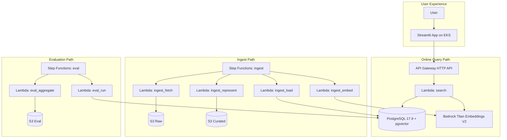

# Semantic Pokédex Architecture

This document explains the initial architecture for ingestion, indexing, semantic query serving, and offline evaluation.

## System overview

The platform is split into two execution planes:

1. **Online query plane** for user searches from Streamlit.
2. **Offline data/evaluation plane** for ingestion and experiment runs.

Both planes write to or read from the same PostgreSQL + pgvector datastore.

## High-level diagram

## Ingest data flow

The ingest flow is designed for extensibility and reproducibility:

1. **FetchPokeAPI**
   - Pulls Pokémon records (targeting generations 1 and 2).
   - Stores raw payloads in S3 raw bucket for traceability.

2. **EnrichSmogon**
   - Adds competitive context (tier, roles, hazards, resistances, weaknesses).
   - Produces curated payloads in S3 curated bucket.

3. **RepresentAndEmbed (Map)**
   - Iterates over representation strategy versions (`v1`, `v2`, `v3`, `v4`).
   - For each strategy, creates representation text, computes embeddings, and loads into DB.
   - Uses bounded map concurrency for cost and throttling control.

4. **Load**
   - Upserts rows and strategy-specific text/embedding columns in `pokemon`.
   - Keeps metadata and stats as JSONB for future feature additions.

## Query data flow

The query path is intentionally simple and testable:

1. Streamlit sends POST `/search` with:
   - `query`,
   - `strategy`,
   - `model`,
   - `top_k`,
   - `ef_search`,
   - optional metadata filters (`types`, `tier`, `generation`).

2. Search Lambda:
   - validates payload,
   - embeds query text (Titan in Lambda mode),
   - builds SQL via pure `build_search_sql` function,
   - runs DB query and returns top-k ranked rows.

3. PostgreSQL + pgvector:
   - uses `<=>` cosine distance operator,
   - applies metadata filtering,
   - uses HNSW index for ANN speedups.

## Evaluation data flow

The evaluation flow supports controlled experiments:

1. Generate cartesian combinations of:
   - strategy,
   - ef_search,
   - top_k.
2. Run benchmark queries for each combination in parallel map workers.
3. Aggregate metrics into summary payload:
   - recall@10,
   - MRR@10,
   - p50 and p95 latency.
4. Persist result artifact to S3 for review and plotting.

## Networking and security assumptions

- Lambda runs in VPC subnets from environment variables.
- DB credentials are loaded from Secrets Manager (`DB_SECRET_ARN`).
- Function-level IAM is scoped in serverless function definitions.
- Streamlit service account uses IRSA annotation placeholder.
- Placeholder resource names are intentionally non-production.

## Operational notes

- This PR avoids deployment execution and focuses on parseable scaffolding.
- Secrets, VPC IDs, subnets, account IDs, and role ARNs stay externalized.
- Language in all repository artifacts is English.

## Future hardening checklist

- Add schema migrations with rollback strategy.
- Add request/response contracts and stricter Pydantic models.
- Add query tracing IDs across UI/API/Lambda/DB logs.
- Add dead-letter handling for failed ingest chunks.
- Add load tests and threshold alarms.
